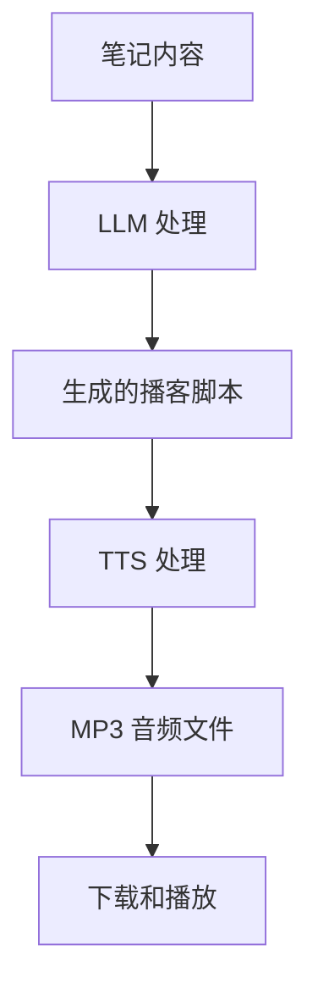

# 🎙️ 播客生成器

将你的笔记转化为高质量的播客。使用 AI 生成脚本，支持独白和对话模式，多种音色可选。

[English](./README_EN.md)

## ✨ 功能

- **🤖 AI 驱动的脚本生成** - 使用大语言模型自动将笔记转换为自然流畅的播客脚本
- **🎙️ 多种生成模式** - 支持独白模式和对话模式
- **🎵 自定义音色选择** - 支持多种音色选择，适配不同场景
- **📝 脚本预览** - 在生成音频前预览和查看生成的脚本
- **🔊 音频生成** - 使用 TTS 技术将脚本转换为高质量音频
- **💾 MP3 导出** - 支持将播客下载为 MP3 文件
- **🌍 国际化支持** - 支持中英文界面
- **⚙️ 简易配置** - 只需配置 API 密钥即可使用
- **🎨 现代化 UI** - 美观直观的界面，实时反馈生成进度

## 🚀 快速开始

### 安装

1. 打开 Obsidian 设置 → 第三方插件 → 浏览社区插件
2. 搜索 "Podcast Generator"
3. 安装并启用插件

### 配置

1. 在 Obsidian 中打开插件设置
2. 配置必要的 API 密钥：
   - **LLM API Key**: 用于脚本生成的 StepFun API 密钥
   - **TTS API Key**: 用于音频生成的 StepFun API 密钥
3. （可选）调整音色偏好和默认设置

### 使用

1. 打开想要转换为播客的笔记
2. 点击侧边栏的"播客生成器"图标
3. 选择生成模式：
   - **单人独白**: 单个讲述者音色
   - **双人对话**: 两个讲话者的对话格式
4. 选择音色选项
5. 点击"生成播客"按钮
6. 查看生成的脚本并试听音频
7. 点击"导出 MP3"下载播客文件

## 📖 工作原理

### 生成流程



### 独白模式

- 单个讲述者呈现内容
- 适合教育类或讲解类内容
- 音色风格一致

### 对话模式

- 两个讲话者（主持人和嘉宾）讨论内容
- 更加生动有趣
- 模拟真实的对话风格

## ⚙️ 设置

### API 配置

| 设置 | 说明 |
|------|------|
| LLM API Key | 脚本生成用的 API 密钥（必填，兼容 OpenAI SDK 格式） |
| LLM Model | 模型名称（默认：step-2-mini） |
| LLM Base URL | API 端点（默认：`https://api.stepfun.com/v1`，兼容 OpenAI SDK 格式） |
| TTS API Key | 音频生成用的 API 密钥（必填，兼容 OpenAI SDK 格式） |
| TTS Model | 模型名称（默认：step-tts-2） |
| TTS Base URL | API 端点（默认：`https://api.stepfun.com/v1`，兼容 OpenAI SDK 格式） |

### 音色设置

| 设置 | 说明 |
|------|------|
| 独白音色 | 独白模式使用的音色 |
| 主持人音色 | 对话模式中主持人的音色 |
| 嘉宾音色 | 对话模式中嘉宾的音色 |

### 默认偏好

| 设置 | 说明 |
|------|------|
| 默认语言 | 界面语言（中文/英文） |
| 默认模式 | 默认生成模式（独白/对话） |

## 🎯 使用场景

### 教育内容

将讲座笔记转换为播客集，方便在路上学习。

### 文档

将技术文档转换为音频指南。

### 博客文章

为博客文章生成播客版本。

### 会议记录

将会议笔记转换为回顾播客。

### 故事讲述

将故事笔记转换为叙述型音频内容。

## 🛠️ 开发

### 需求

- Node.js 16+
- npm 或 yarn

### 设置

```bash
npm install
npm run dev
```

### 构建

```bash
npm run build
```

### 测试

```bash
npm run dev
```

## 📄 许可证

MIT 许可证 - 详见 LICENSE 文件

## 🤝 贡献

欢迎提交问题报告或拉取请求！

## 💬 支持

如有问题、功能请求或其他问题：

- 在 [GitHub](https://github.com/li-xiu-qi/obsidian-podcast-core) 上提交 Issue

## 🙏 致谢

- 基于 [Obsidian API](https://docs.obsidian.md/Plugins/Getting+started/Build+a+plugin)
- 使用 [Vue 3](https://vuejs.org/) 构建 UI
- 集成 [StepFun API](https://www.stepfun.com/)
- UI 组件来自 [Naive UI](https://www.naiveui.com/)

---

**版本**: 0.01  
**作者**: li-xiu-qi  
**许可证**: MIT
