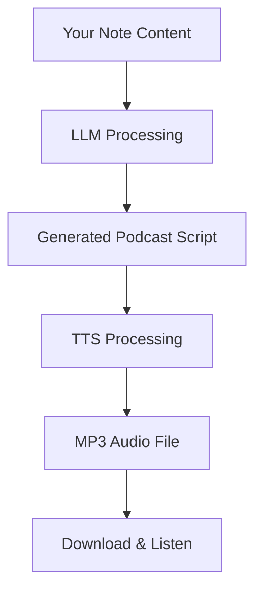

# 🎙️ Podcast Core

Transform your notes into engaging podcasts using AI. Generate scripts and audio with customizable voices for solo monologues or dialogues.

[中文文档](./README.md)

## ✨ Features

- **🤖 AI-Powered Script Generation** - Automatically convert your notes into natural, engaging podcast scripts using LLM
- **🎙️ Multiple Generation Modes** - Choose between monologue or dialogue formats
- **🎵 Custom Voice Selection** - Select from multiple voice options for narrators and hosts
- **📝 Script Preview** - Review and see the generated script before audio generation
- **🔊 Audio Generation** - Convert scripts to high-quality audio using TTS technology
- **💾 MP3 Export** - Download generated podcasts as MP3 files
- **🌍 International Support** - Support for English and Chinese interfaces
- **⚙️ Easy Configuration** - Simple setup with API key configuration
- **🎨 Modern UI** - Beautiful, intuitive interface with real-time feedback

## 🚀 Quick Start

### Installation

1. Open Obsidian Settings → Third-party plugins → Community plugins
2. Search for "Podcast Core"
3. Install and enable the plugin

### Configuration

1. Open the plugin settings in Obsidian
2. Configure the required API keys:
   - **LLM API Key**: Your StepFun API key for script generation
   - **TTS API Key**: Your StepFun API key for audio generation
3. (Optional) Adjust voice preferences and default settings

### Usage

1. Open a note with content you want to convert to podcast
2. Click the "Podcast Generator" icon in the sidebar
3. Select your preferred mode:
   - **Solo Monologue**: Single narrator voice
   - **Dialogue**: Two-speaker conversation format
4. Choose voice options
5. Click "Generate Podcast"
6. Review the generated script and listen to the audio
7. Click "Export MP3" to download

## 📖 How It Works

### Generation Process



### Monologue Mode

- Single narrator presents the content
- Natural flow suitable for educational or explanatory content
- Consistent voice throughout

### Dialogue Mode

- Two speakers (Host and Guest) discuss the content
- More engaging and dynamic
- Natural conversation style

## ⚙️ Settings

### API Configuration

| Setting | Description |
|---------|------------|
| LLM API Key | API key for script generation (required, OpenAI SDK compatible) |
| LLM Model | Model name (default: step-2-mini) |
| LLM Base URL | API endpoint (default: `https://api.stepfun.com/v1`, OpenAI SDK compatible) |
| TTS API Key | API key for audio generation (required, OpenAI SDK compatible) |
| TTS Model | Model name (default: step-tts-2) |
| TTS Base URL | API endpoint (default: `https://api.stepfun.com/v1`, OpenAI SDK compatible) |

### Voice Settings

| Setting | Description |
|---------|------------|
| Monologue Voice | Voice for solo mode |
| Host Voice | Voice for dialogue host |
| Guest Voice | Voice for dialogue guest |

### Default Preferences

| Setting | Description |
|---------|------------|
| Default Language | Language for interface (Chinese/English) |
| Default Mode | Default generation mode (Monologue/Dialogue) |

## 🎯 Use Cases

### Educational Content

Convert lecture notes into podcast episodes for studying on-the-go.

### Documentation

Turn technical documentation into audio guides.

### Blog Posts

Generate podcast versions of your blog articles.

### Meeting Notes

Transform meeting minutes into recap podcasts.

### Story Telling

Convert story notes into narrated audio content.

## 🛠️ Development

### Requirements

- Node.js 16+
- npm or yarn

### Setup

```bash
npm install
npm run dev
```

### Build

```bash
npm run build
```

### Testing

```bash
npm run dev
```

## 📄 License

MIT License - See LICENSE file for details

## 🤝 Contributing

Contributions are welcome! Please feel free to submit issues or pull requests.

## 💬 Support

For issues, feature requests, or questions:

- Open an issue on [GitHub](https://github.com/li-xiu-qi/obsidian-podcast-core)

## 🙏 Acknowledgments

- Built with [Obsidian API](https://docs.obsidian.md/Plugins/Getting+started/Build+a+plugin)
- Uses [Vue 3](https://vuejs.org/) for UI
- Integrates with [StepFun API](https://www.stepfun.com/)
- UI components from [Naive UI](https://www.naiveui.com/)

---

**Version**: 0.01  
**Author**: li-xiu-qi  
**License**: MIT