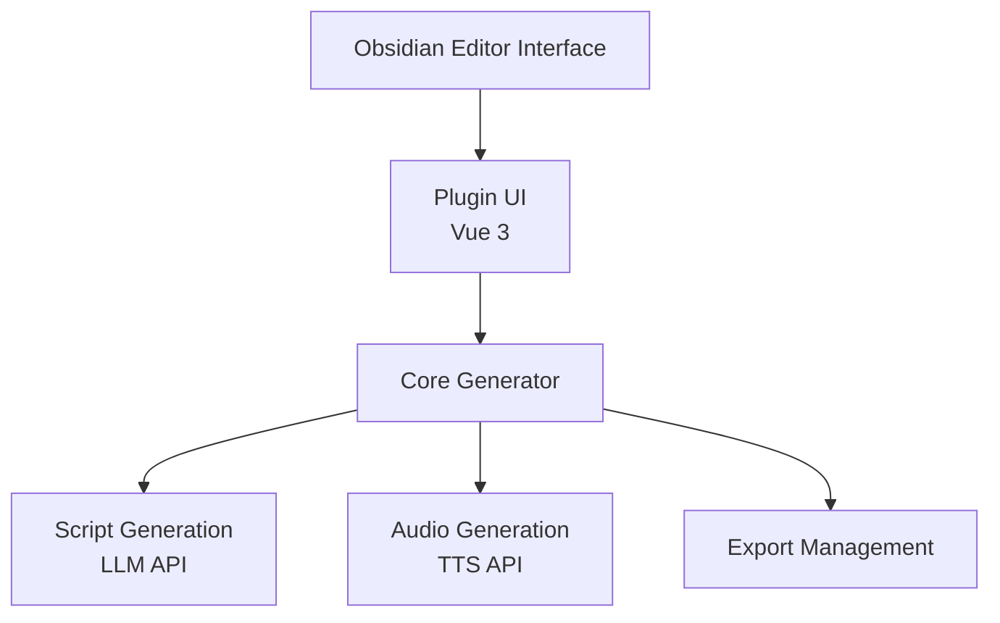
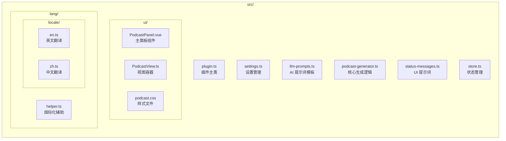
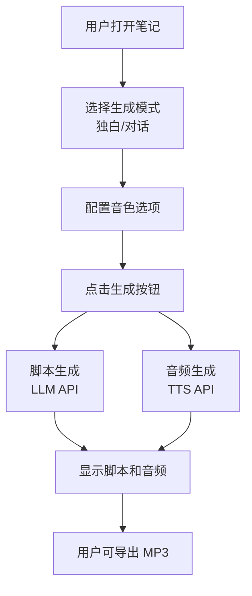

# 播客生成器设计文档

## 项目概述

**播客生成器**是一个 Obsidian 插件，用于将用户的笔记内容转换为高质量的播客音频。通过集成 AI 大模型和 TTS（文本转语音）技术，用户可以轻松生成专业级的播客内容。

### 核心功能

1. **脚本生成** - 使用 LLM 将笔记转换为播客脚本
2. **多种模式** - 支持独白和对话两种生成模式
3. **音声定制** - 支持多种音色选择
4. **音频生成** - 使用 TTS 将脚本转换为音频
5. **导出功能** - 支持 MP3 格式导出

---

## 架构设计

### 系统架构



### 模块结构



---

## 功能流程

### 1. 播客生成流程



### 2. 脚本生成

**输入**: 笔记内容  
**处理**:
1. 用户笔记作为内容输入
2. 根据选定模式选择对应的提示词
3. 将提示词 + 内容发送给 LLM
4. 解析 LLM 返回的纯文本格式脚本

**输出**: 结构化脚本对象数组

```typescript
interface PodcastScript {
    speaker: string;  // "Narrator" | "Host" | "Guest"
    text: string;     // 说话内容
}
```

### 3. 音频生成

**输入**: 脚本对象数组  
**处理**:
1. 对于独白模式：合并所有文本
2. 对于对话模式：保留说话者信息
3. 调用 TTS API 生成音频
4. 返回可播放的音频 URL

**输出**: 音频 Blob URL

### 4. 导出流程

**输入**: 音频 URL  
**处理**:
1. 获取当前文件名
2. 生成文件名：`{filename}-{date}.mp3`
3. 触发浏览器下载
4. 显示成功提示

**输出**: 本地 MP3 文件

---

## 提示词设计

### 系统提示词 (PODCAST_SYSTEM_PROMPT)

**目的**: 定义 AI 的角色和输出格式要求

**关键要素**:
- 角色定义：专业播客脚本作家
- 输出格式：纯文本 `Speaker: text` 格式（不是 JSON）
- 创作指南：自然口语、节奏控制、情绪表达

**示例输出**:
```
Narrator: 嘿大家好，我是你们的讲述者。
Narrator: 今天我想和你们分享一个有趣的故事。
```

### 模式特定提示词

#### 独白模式 (MONOLOGUE_PROMPT)
- 单一说话者：Narrator
- 自然独白风格
- 自然流畅的叙述

#### 对话模式 (DIALOGUE_PROMPT)
- 双说话者：Host 和 Guest
- 模拟真实对话
- 自然交替进行

---

## 数据流

### 1. 设置数据

```typescript
interface PodcastSettings {
    llmApiKey: string;           // LLM API 密钥
    llmModel: string;            // LLM 模型名称
    llmBaseUrl: string;          // LLM API 端点
    ttsApiKey: string;           // TTS API 密钥
    ttsModel: string;            // TTS 模型名称
    ttsBaseUrl: string;          // TTS API 端点
    monologueVoice: string;      // 独白音色
    hostVoice: string;           // 主持人音色
    guestVoice: string;          // 嘉宾音色
}
```

### 2. 状态管理

```typescript
// UI 组件状态
- currentMode: 'monologue' | 'dialogue'     // 当前模式
- isGenerating: boolean                      // 生成中状态
- logs: string[]                             // 日志消息
- script: PodcastScript[] | null             // 生成的脚本
- audioUrl: string | null                    // 音频 URL
- currentLanguage: string                    // 当前语言
```

---

## API 集成

### LLM API (StepFun)

**用途**: 脚本生成

**请求**:
```typescript
{
    model: string,           // 模型名称
    messages: Array,         // 消息数组
    temperature: number,     // 创意度 (0.7)
    max_tokens: number,      // 最大标记数 (2000)
}
```

**响应**:
```typescript
{
    choices: [{
        message: {
            content: string  // 生成的脚本文本
        }
    }]
}
```

### TTS API (StepFun)

**用途**: 音频生成

**请求**:
```typescript
{
    model: string,      // 模型名称
    voice: string,      // 音色 ID
    input: string,      // 文本内容
}
```

**响应**: 音频 MP3 数据

---

## 错误处理

### 验证层

1. **设置验证**
   - 检查 API 密钥是否配置
   - 验证模型名称是否有效

2. **输入验证**
   - 检查是否打开了文件
   - 验证文件内容不为空

3. **输出验证**
   - 检查脚本格式是否正确
   - 验证音频 URL 是否有效

### 异常处理

```typescript
try {
    // 执行操作
} catch (error) {
    // 记录错误日志
    addLog(`Error: ${error.message}`);
    // 显示用户通知
    new Notice(`Error: ${message}`);
    // 打印控制台日志
    console.error(error);
}
```

### 回退机制

1. **API 调用回退**
   - 首先使用原生 fetch
   - 失败则使用 OpenAI SDK

2. **脚本解析回退**
   - 优先解析纯文本格式
   - 失败则尝试 JSON 格式
   - 最后使用行分割方式

---

## 用户界面

### 主面板组件 (PodcastPanel.vue)

#### 区段设计

1. **头部区段**
   - 插件标题和描述

2. **配置区段**
   - 语言选择
   - 生成模式选择
   - 音色配置

3. **控制区段**
   - 生成按钮

4. **日志区段**
   - 生成过程的日志输出

5. **结果区段**
   - 音频播放器
   - MP3 导出按钮
   - 脚本显示（对话气泡风格）

### 样式设计

- **卡片化设计**: 使用统一的卡片容器
- **现代风格**: 圆角、阴影、渐变
- **响应式布局**: 适配不同屏幕尺寸
- **主题适配**: 支持深色和浅色主题

---

## 国际化 (i18n)

### 支持语言

- **英文** (en.ts)
- **中文** (zh.ts)

### 翻译键值对

```typescript
// UI 标签
'Podcast Generator'
'Language'
'Generation Mode'
'Solo Monologue'
'Dialogue'

// 操作按钮
'Generate Podcast'
'Export MP3'

// 状态消息
'Generating podcast script...'
'Podcast generated successfully!'
'No audio available to export'
```

---

## 性能优化

### 1. API 调用优化

- 使用原生 fetch 减少库开销
- 支持流式响应（未来扩展）
- API 调用超时控制

### 2. 内存管理

- 及时释放 Blob URL
- 避免重复生成相同内容
- 清理过期的日志

### 3. UI 响应

- 使用加载状态禁用按钮
- 显示实时进度日志
- 平滑的过渡动画

---

## 扩展性设计

### 未来功能

1. **多语言支持** - 新增语言翻译
2. **高级音色定制** - 自定义音色参数
3. **批量生成** - 一次性处理多个文件
4. **编辑功能** - 生成后编辑脚本
5. **云存储** - 保存生成的播客
6. **发布功能** - 直接发布到播客平台

### 插件架构

```typescript
// 核心接口
interface IPodcastGenerator {
    generateScript(): Promise<PodcastScript[]>;
    generateAudio(): Promise<string>;
    exportAudio(): Promise<void>;
}

// 可扩展的提供者
interface ITTSProvider {
    generateAudio(text: string, voice: string): Promise<ArrayBuffer>;
}

interface ILLMProvider {
    generateScript(content: string, prompt: string): Promise<string>;
}
```

---

## 开发指南

### 本地开发

```bash
# 安装依赖
npm install

# 开发模式
npm run dev

# 构建
npm run build

# 版本更新
npm run version
```

### 代码规范

- 使用 TypeScript 进行类型检查
- 遵循 ESLint 规则
- Vue 3 Composition API
- 中英文混合注释

### 提交规范

- feat: 新功能
- fix: 错误修复
- docs: 文档更新
- refactor: 代码重构
- test: 测试
- chore: 构建/工具

---

## 故障排查

### 常见问题

| 问题 | 原因 | 解决方案 |
|------|------|--------|
| API 密钥无效 | 密钥未配置或过期 | 检查设置中的 API 密钥 |
| 生成失败 | 网络连接问题 | 检查网络连接 |
| 音频播放失败 | 浏览器不支持 | 使用现代浏览器 |
| 脚本格式错误 | LLM 输出格式异常 | 检查提示词是否正确 |

---

## 版本历史

### v0.01 (2024-12-01)

- 初始版本发布
- 支持独白和对话两种模式
- 集成 StepFun LLM 和 TTS API
- 支持 MP3 导出
- 支持中英文界面
- 完整的错误处理和用户反馈

---

## 许可证

MIT License - 详见 LICENSE 文件

---

## 贡献指南

欢迎提交 Pull Request 或 Issue！

---

## 联系方式

- GitHub: https://github.com/li-xiu-qi
- 问题报告: GitHub Issues

